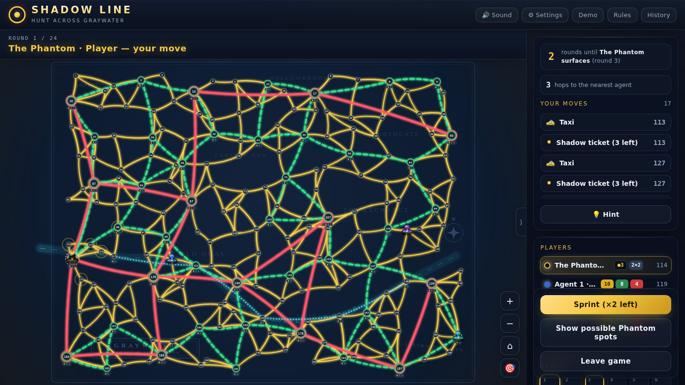
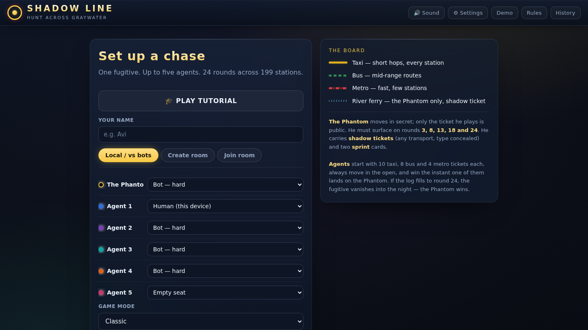
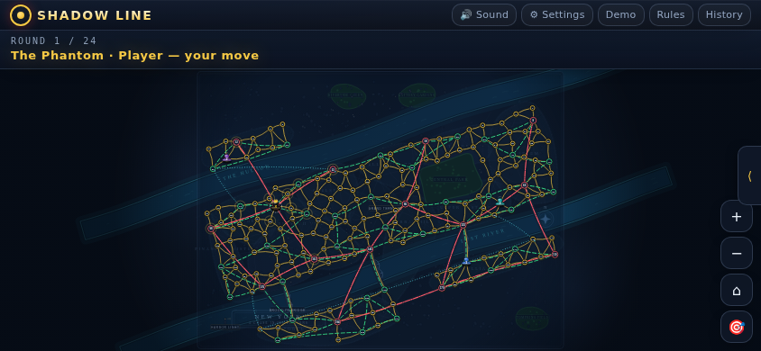

# 🕵️ Shadow Line — Hunt the Phantom Across Graywater

**SHADOW LINE** is a free, installable, browser-playable hidden-movement chase game. One player is **the Phantom**, slipping through the illustrated city of Graywater in secret; up to five **agents** have 24 rounds to run him down.

Play solo against bots, hot-seat with friends on one device, or host/join a peer-to-peer online room — no account, no server, no install required (though you can install it).

  

---

## ✨ Highlights

- 🎨 **Hand-built illustrated map** — 199 stations, 449 taxi/bus/metro/ferry connections, rendered as SVG at runtime with parchment/night-map styling, with parchment-poster and neon night board styles.
- 🤖 **Bots with real strategy** — three difficulty tiers (easy / normal / hard) for either role, from random-legal moves up to hard agents that anticipate and cover the Phantom's *next-round* escape routes as a coordinated team.
- 🧑‍🤝‍🧑 **Three ways to play** — solo vs. bots, hot-seat on one device (with an automatic "pass the device" privacy handoff), or online rooms over WebRTC.
- 📡 **Peer-to-peer online rooms** — share a 5-letter code, no backend server, with room chat and a live activity feed.
- 👁️ **Spectator mode** — watch a live online room without occupying a seat or seeing anything an agent couldn't.
- 💾 **Resume where you left off** — refreshing mid-game (local or online) doesn't lose your progress.
- 📜 **Game history & replay** — every finished game is logged locally with a win/loss summary, a step-through move replay, and a copyable text recap.
- 🏆 **Shared room stats** — everyone in an online room sees the same list of recent results for that room.
- 🌈 **Colorblind-friendly transport lines** — each transport type has a distinct stroke pattern (solid/dashed/dash-dot/dotted) in addition to its color.
- 📴 **Installable & offline-capable** — add it to your home screen; local and bot games keep working with no connection.
- 🎓 **Guided tutorial** — an interactive, driver.js-powered walkthrough for first-time players.
- 💡 **On-demand move hints** — stuck on your turn? "Suggest a move" runs the hard-bot logic on your own position and flashes the recommended move.
- ↶ **Undo** — take back your move in solo/vs-bots games (disabled online and in hot-seat privacy games, where a rewind could leak the Phantom's hidden move).
- ⌨️ **Keyboard shortcuts** — `1`–`9` play the nth listed move, `H` hint, `U` undo, `P` toggle possible spots, `D` sprint.
- 🏅 **Achievements** — unlock milestones (first win, win on both sides, an 8-round dragnet, a 24-round escape…) shown on the history screen.
- 🎯 **Proximity readout** — the turn panel shows how many hops separate you from the nearest agent (as the Phantom) or the nearest suspect station (as an agent).
- ⏱️ **Next-reveal HUD** — an always-visible countdown to the round the Phantom must next surface, so agents can time the squeeze.
- ⌨️ **Keyboard & screen-reader accessible** — play the whole move loop from a labeled move list with live turn/result announcements, no pinpoint tapping required.
- ⚙️ **Settings** — light/dark theme, sound-volume slider, opt-in ambient music, bot-speed control, reduce-motion switch, and a high-contrast board, all persisted locally.
- 🔥 **Belief heatmap** — the "possible Phantom spots" overlay is weighted: brighter, larger halos mark the stations his ticket trail makes most likely.
- 📊 **Results timeline** — the history screen charts your recent wins/losses (by role) as a compact inline-SVG strip.
- 🎲 **Game modes** — pick a rule preset for local games: **Classic** (24 rounds, five reveals), **Short chase** (a brisk 12-round game), or **Fugitive's edge** (only three reveals, with extra shadow tickets and sprints).
- 🔊 **Synthesized sound** — every effect is generated at runtime with the Web Audio API, no audio files.

## 📸 Screenshots

<table>
<tr>
<td width="50%"></td>
<td width="50%"></td>
</tr>
<tr>
<td align="center">Lobby — set up seats, or create/join an online room</td>
<td align="center">In-game — the Graywater board, turn panel, and travel log</td>
</tr>
<tr>
<td colspan="2"></td>
</tr>
<tr>
<td colspan="2" align="center">Mobile (landscape) in-game view</td>
</tr>
</table>

## 🚀 Running it

Plain HTML/CSS/JS, no build step and no dependencies.

- **Quickest:** open `index.html` directly in a browser.
- **Recommended:** serve it over `http(s)://` (e.g. `npx serve .` or any static file server) rather than `file://`, since browsers restrict Web Audio, clipboard, and service-worker APIs on `file://`.
- **Install it as an app:** once served over HTTP(S), most browsers will offer an "Install"/"Add to Home Screen" option — the app is a full PWA with an offline-capable service worker.

Online rooms are peer-to-peer (WebRTC via [PeerJS](https://peerjs.com)) — no backend of any kind. If your browser or network doesn't support WebRTC, the app detects this automatically, disables "Create room"/"Join room", and explains why; local/hot-seat play and bots are unaffected.

## 🎮 How to play

- **Setup:** the lobby lets you assign each of the 6 seats (the Phantom + up to 5 agents) to a human or a bot (easy/normal/hard), or leave agent seats empty, and pick a **game mode** (Classic / Short chase / Fugitive's edge) for local games.
- **The Phantom** moves first each round, in secret — only the ticket type he plays (taxi/bus/metro/shadow) is shown to agents. He must surface and reveal his true station on rounds **3, 8, 13, 18, and 24**.
- **Agents** move in turn order after the Phantom, always in the open, spending real tickets (10 taxi / 8 bus / 4 metro each, standard allocation). Two agents can't share a station.
- **Win conditions:** agents win instantly if one lands on the Phantom's station, or if the Phantom ever has no legal move. The Phantom wins if the round log fills to 24 without being caught, or if every agent is stuck.
- **Shadow tickets** let the Phantom take any transport (including the river ferry) without revealing which one. **Sprint** cards let him take two hops in one round.
- Tap/click a highlighted station to move; if it's reachable by more than one ticket type, a small chooser pops up. Drag to pan, scroll/pinch to zoom. Prefer the keyboard? Every legal move is also listed as a button in the **turn panel** — activate one to move.
- Not sure what to do? Hit **💡 Suggest a move** for an AI recommendation, and watch the **next-reveal countdown** at the top of the turn panel to plan around the Phantom's forced surfacings.
- **Keyboard shortcuts** during a game: number keys `1`–`9` play the nth move in the list, `H` for a hint, `U` (or `Z`) to undo in local games, `P` to toggle the possible-locations overlay, `D` to arm a sprint. **Undo** and **Achievements** round out the extras — undo rewinds to your last decision in solo/vs-bots games; achievements track milestones on the History screen.
- A "show possible Phantom spots" toggle lets you see the live deduced location set, drawn as a **belief heatmap** — brighter/larger halos are the stations his ticket trail makes most likely.
- New to the game? Hit **Play Tutorial** on the lobby screen for an interactive, guided first game.

## 🤖 Bots

Three difficulty tiers, for either role, so the challenge ramps smoothly from a first game to an expert one:

- **Easy:** picks a random legal move (the Phantom avoids spending shadow tickets unless forced).
- **Normal:** a solid single-piece heuristic — agents track the Phantom's possible-location set from ticket types and reveal rounds and close on it while spreading across high-connectivity junctions; the Phantom keeps his distance from the nearest agent, avoids dead ends, and uses shadow tickets when a move is ferry-only.
- **Hard:** adds anticipation and coordination on top of that.
  - *Agents* cover the whole set of stations the Phantom could reach **next** round, not just where he is now — because a skilled fugitive dodges the single likeliest spot, uniform containment beats chasing it. They split the work through a nearest-teammate baseline (each covers the suspects no one else is near) so they fan out instead of clumping, and still pounce on any direct catch.
  - *the Phantom* reads two moves deep — shying away from stations that are one *or* two hops from an agent — and spends a sprint to break contact when cornered.

The hard agents measurably out-perform the previous logic (about +4–5 percentage points of win rate at every agent count in headless simulation), and both difficulty ladders are monotonic — see the [testing](#-testing-so-far) section for the reproducible numbers.

## 🧑‍🤝‍🧑 Multiplayer

- **Hot-seat:** multiple humans on one device. If any human plays an agent while a human also plays the Phantom, the app blanks the Phantom's position between turns and prompts a "pass the device" handoff so agents can't see it.
- **Online rooms:** the host creates a 5-letter room code; rooms are peer-to-peer over WebRTC (PeerJS), host-authoritative, with no backend server at all — the host's browser tab *is* the room. Clients connect directly, browser to browser. Any seat left "open" when the host starts becomes a hard bot.
  - **Room chat** with join/leave system notices and a live cross-player activity feed.
  - **Spectator join:** watch a room live without claiming a seat — you see exactly what an agent would see (the Phantom hidden except on reveal rounds), and every move/ticket-chooser affordance is inert for you.
  - **Room history:** everyone connected to a room sees the same list of that room's recent results. This is visible to anyone with the room code — same trust model as the rest of online play, not private.
  - **Resume:** if your tab refreshes mid-game, the app remembers your room/identity and tries to reconnect — this only works if the host (or, for the host itself, its connection) is still reachable, since there's no server to fall back on.

## ☁️ Optional account sync (Firebase)

Everything works signed-out and offline; nothing requires an account. But if you supply a Firebase project config in `firebase-config.js` (documented placeholders ship in the repo — the layer is fully dormant until you do), the lobby gains **Sign in with Google**: your display name, win/loss history, achievements (derived from history), and the remove-ads entitlement then sync across every device you sign in on. Histories merge local-first — two devices converge without losing games — and per-move replay logs deliberately stay device-local. The SDK is fetched lazily from the CDN only when configured, so offline/PWA/CI use is never blocked.

## 💾 Persistence, history & replay

- **Mid-game resume:** local, solo-vs-bots, and online games all persist to your browser's local storage after every move. Reload the page and you'll be offered "Resume game?" instead of losing progress. Hot-seat privacy is preserved — the Phantom's position never leaks on a resume.
- **Game history:** every finished game you played in is recorded locally (date, role, result, round, bots vs. humans), with a simple win-rate summary by role. Nothing leaves your browser.
- **Replay:** open any past game's move-by-move replay — step forward/back or jump to any move — and copy a plain-text recap to share. The Phantom's hidden moves stay hidden in the replay unless they were actually revealed that round.

## 🌈 Accessibility

Transport lines carry a distinct **stroke pattern** in addition to their color — taxi solid, bus dashed, metro dash-dot, river ferry dotted — plus a legend showing pattern + color + label for each. This keeps the map readable under red-green colorblindness (the hardest case: bus/green vs. metro/red) without changing the colors players already know.

Beyond color, the app now offers a **keyboard- and screen-reader-accessible way to play**: on your turn, every legal move is listed as a labeled button ("Move to station 45 by Taxi") in the turn panel, so you can move without hitting a pinpoint target on the SVG map. A polite `aria-live` region announces whose turn it is, how many moves are available, hints, and the final result; icon-only controls carry `aria-label`s. **Settings** (⚙ in the header) add a **light/dark theme**, a **reduce-motion** switch, and a **high-contrast board** option (bolder station numbers and route strokes) alongside a sound-volume slider, an opt-in ambient-music toggle, and a bot-speed control.

## 🗺️ Map data

The city of Graywater is entirely original: its 199 stations and 449 taxi/bus/metro/ferry connections are produced by a deterministic, seeded map designer (`tools/mapgen/generate.js`) that lays out a planar taxi street mesh, a hub-based bus overlay, metro trunk lines, and a meandering river with a ferry line, then bakes the result into `engine.js`. The artwork — background, districts, parks, the river, station badges, and route styling — is likewise original, rendered as SVG at runtime (see `buildMap()` in `map.js`). Re-run the generator with a new seed for a different city, then re-check balance with `node test/simulate.js`.

## 🛠️ Tech notes

- Plain HTML/CSS/JS, no framework, no build step. External requests are limited to Google Fonts, [driver.js](https://driverjs.com) (tutorial), and [PeerJS](https://peerjs.com) (online rooms) via CDN.
- Map and pieces are rendered as SVG; pan/zoom is done by mutating `viewBox`, with pointer events used for both drag-panning and tap-to-select (so panning and tapping a station don't conflict).
- Sound effects are synthesized at runtime with the Web Audio API — no audio files.
- Rules engine (`newGame`, `applyMrx`, `applyDet`, `possibleSet`) is written as pure functions over a plain game-state object, independent of the DOM/rendering code, which is what made it possible to headlessly simulate hundreds of full games for testing.
- The game object is intentionally plain, JSON-safe data — that's what lets persistence (`persistence.js`), replay logging, and online sync all piggyback on it directly instead of needing a second parallel representation.
- A versioned, cache-first service worker (`sw.js`) caches the core app shell for offline local/bot play; it doesn't and can't make online rooms work offline, since those need a live peer connection.

## 📁 Code layout

The app is split into plain `<script>`-tag modules (no bundler, loaded in this order):

| File | Responsibility |
|---|---|
| `index.html` | Page layout/markup only. |
| `styles.css` | All styling. |
| `engine.js` | The station graph (positions/connections), distances, and the pure-function rules engine (`newGame`, `applyMrx`, `applyDet`, `possibleSet`, move generation). No DOM access. |
| `bots.js` | The easy/hard bot pickers for the Phantom and the agents, built on top of `engine.js`. No DOM access. |
| `map.js` | SVG map construction, pan/zoom, and vehicle movement animation. |
| `history.js` | Local (`localStorage`) per-device game history and room-wide shared-stats helpers. |
| `persistence.js` | Mid-game save/resume (one local save slot, for both local and online games). |
| `tutorial.js` | The driver.js-powered interactive first-time tutorial. |
| `sound.js` | Runtime Web-Audio sound effects (no audio files). |
| `firebase-config.js` | Owner-supplied Firebase config (documented placeholders; cloud layer dormant until filled). |
| `cloud.js` | Optional Google sign-in + Firestore cross-device sync of name/history/entitlements. |
| `enhancements.js` | Player-facing polish: settings, keyboard/screen-reader move list, reveal HUD, hints, undo, proximity readout, ambient music, belief heatmap, achievements, and the end-game debrief. |
| `ui.js` | Core game/UI state, rendering, move flow, lobby/hot-seat/online-room flow, and boot. |
| `manifest.json`, `sw.js` | PWA scaffolding — install metadata and the offline service worker. |
| `test/simulate.js` | Dependency-free headless harness — runs bot-vs-bot games to check engine invariants (across difficulties and game modes) and report difficulty balance. |
| `test/ui/` | Playwright UI suite + a tiny static server, run against desktop and mobile-landscape viewports. |
| `playwright.config.js`, `package.json` | UI-test config and npm scripts (`test:sim`, `test:ui`, `test:all`). |
| `.github/workflows/ci.yml` | GitHub Actions CI — runs the engine sim and the UI suite on every push/PR. |

## ⚠️ Known limitations

- **Online rooms are peer-to-peer with no backend.** The host's browser tab is the room — if it closes and doesn't come back, the room is gone for everyone still in it. Resume can reconnect a dropped tab, but only while the other side is still reachable.
- **Anyone with the room code can join, spectate, or read that room's shared history** — there's no server-side authority. Treat online rooms as "good enough for friends," not cheat-proof.
- **The Phantom's non-shadow ticket supply is treated as unlimited** in this digital version, rather than being recycled from tickets agents spend (the tabletop mechanic). In practice the physical version almost never runs the Phantom out of taxi/bus/metro tickets either, so this shouldn't change how a game plays out, but it's a deliberate simplification worth knowing about.
- **Persistence and replay logs are per-device, local-storage only** — clearing site data clears them. History syncs across devices only when the optional Firebase account layer is configured and you sign in.
- Accessibility support covers the core move loop — a keyboard/screen-reader move list, live turn/result announcements, labeled controls, a reduce-motion switch, and a high-contrast board — but is not a full audit. Panning/zooming the SVG map is still pointer/touch only (you can move via the accessible list without it), and the tutorial/replay flows haven't been screen-reader tested.

## 🧪 Testing so far

Two automated test layers ship with the repo and run in CI on every push/PR (see `.github/workflows/ci.yml`):

- **Rules engine & bots** — a dependency-free headless harness, **`npm run test:sim`** (`node test/simulate.js`), plays thousands of full bot-vs-bot games across every difficulty / agent-count / game-mode combination. It asserts the engine invariants after every move (win conditions, ticket accounting, no two agents on a station, the deduced possible-location set always contains the Phantom's true station, and each variant's round limit and reveal schedule), then prints a balance report of win rates by role and difficulty. `node test/simulate.js --balance 3000` runs a higher-confidence balance sweep.
- **UI** — a [Playwright](https://playwright.dev) suite, **`npm run test:ui`** (`test/ui/*.spec.js`), drives the real app in a headless browser across **desktop and mobile-landscape** viewports: boot → lobby → start game, the full map rendering, the accessible move list / hint / reveal HUD, the belief heatmap, settings apply + persist, achievements and the results timeline, the game-mode picker, and that the page never scrolls horizontally.

`npm run test:all` runs both. None of this is a substitute for real playtesting — bug reports welcome.

## License

MIT — see [LICENSE](LICENSE).
