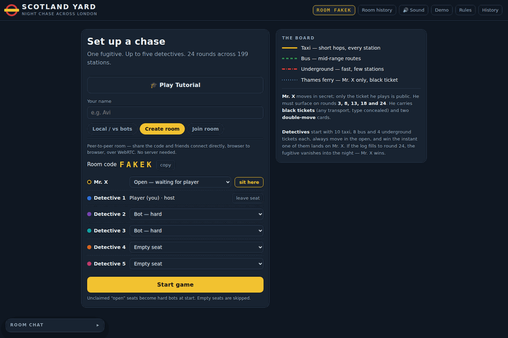
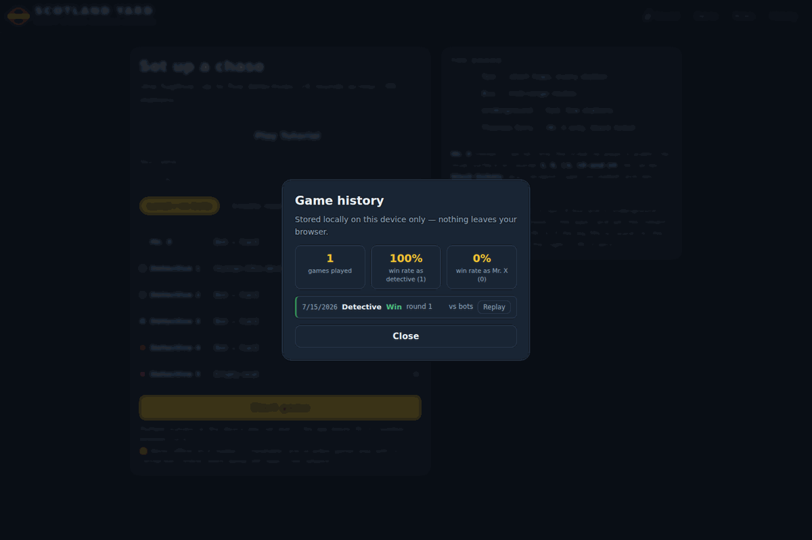
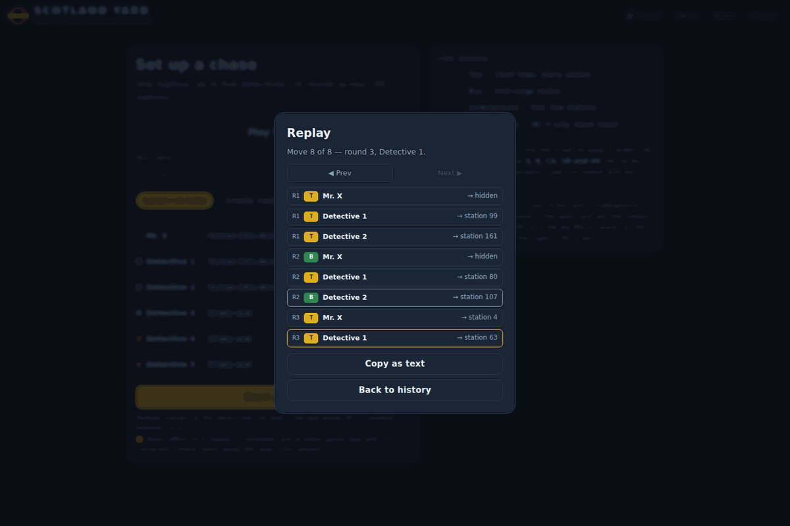
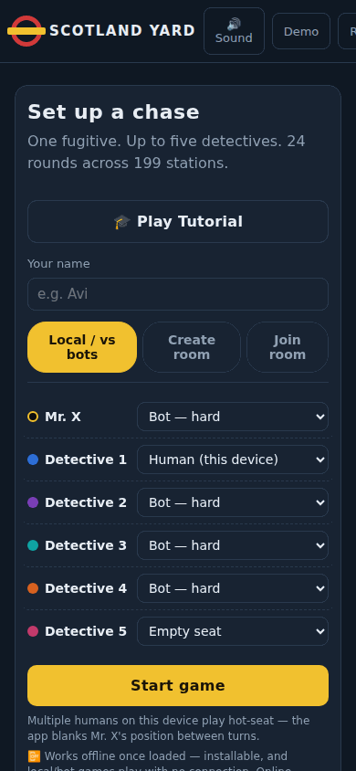

# 🕵️ Scotland Yard — Night Chase Across London

A free, installable, browser-playable adaptation of the classic hidden-movement board game **Scotland Yard**. One player is **Mr. X**, slipping through an illustrated 199-station London map in secret; up to five **detectives** have 24 rounds to run him down.

Play solo against bots, hot-seat with friends on one device, or host/join a peer-to-peer online room — no account, no server, no install required (though you can install it).

This is an original fan implementation: it uses the real published station/connection data and station numbering, but the map artwork, UI, and code are all original. It does not reproduce the official Ravensburger board art.

  

---

## ✨ Highlights

- 🎨 **Hand-built illustrated map** — 199 stations, 467 taxi/bus/underground/ferry connections, rendered as SVG at runtime with parchment/night-map styling, not a scan of the real board.
- 🤖 **Bots with real strategy** — three difficulty tiers (easy / normal / hard) for either role, from random-legal moves up to hard detectives that anticipate and cover Mr. X's *next-round* escape routes as a coordinated team.
- 🧑‍🤝‍🧑 **Three ways to play** — solo vs. bots, hot-seat on one device (with an automatic "pass the device" privacy handoff), or online rooms over WebRTC.
- 📡 **Peer-to-peer online rooms** — share a 5-letter code, no backend server, with room chat and a live activity feed.
- 👁️ **Spectator mode** — watch a live online room without occupying a seat or seeing anything a detective couldn't.
- 💾 **Resume where you left off** — refreshing mid-game (local or online) doesn't lose your progress.
- 📜 **Game history & replay** — every finished game is logged locally with a win/loss summary, a step-through move replay, and a copyable text recap.
- 🏆 **Shared room stats** — everyone in an online room sees the same list of recent results for that room.
- 🌈 **Colorblind-friendly transport lines** — each transport type has a distinct stroke pattern (solid/dashed/dash-dot/dotted) in addition to its color.
- 📴 **Installable & offline-capable** — add it to your home screen; local and bot games keep working with no connection.
- 🎓 **Guided tutorial** — an interactive, driver.js-powered walkthrough for first-time players.
- 🔊 **Synthesized sound** — every effect is generated at runtime with the Web Audio API, no audio files.

## 📸 Screenshots

<table>
<tr>
<td width="50%"></td>
<td width="50%"></td>
</tr>
<tr>
<td align="center">Lobby — set up seats, or create/join an online room</td>
<td align="center">Online room — share a code, no server needed</td>
</tr>
<tr>
<td width="50%"></td>
<td width="50%"></td>
</tr>
<tr>
<td align="center">Game history — local win/loss record with a summary</td>
<td align="center">Replay — step through any finished game's moves</td>
</tr>
<tr>
<td width="50%"></td>
<td width="50%"></td>
</tr>
<tr>
<td align="center">Mobile lobby</td>
<td align="center">Mobile in-game view</td>
</tr>
</table>

## 🚀 Running it

Plain HTML/CSS/JS, no build step and no dependencies.

- **Quickest:** open `index.html` directly in a browser.
- **Recommended:** serve it over `http(s)://` (e.g. `npx serve .` or any static file server) rather than `file://`, since browsers restrict Web Audio, clipboard, and service-worker APIs on `file://`.
- **Install it as an app:** once served over HTTP(S), most browsers will offer an "Install"/"Add to Home Screen" option — the app is a full PWA with an offline-capable service worker.

Online rooms are peer-to-peer (WebRTC via [PeerJS](https://peerjs.com)) — no backend of any kind. If your browser or network doesn't support WebRTC, the app detects this automatically, disables "Create room"/"Join room", and explains why; local/hot-seat play and bots are unaffected.

## 🎮 How to play

- **Setup:** the lobby lets you assign each of the 6 seats (Mr. X + up to 5 detectives) to a human or a bot (easy/normal/hard), or leave detective seats empty.
- **Mr. X** moves first each round, in secret — only the ticket type he plays (taxi/bus/underground/black) is shown to detectives. He must surface and reveal his true station on rounds **3, 8, 13, 18, and 24**.
- **Detectives** move in turn order after Mr. X, always in the open, spending real tickets (10 taxi / 8 bus / 4 underground each, standard allocation). Two detectives can't share a station.
- **Win conditions:** detectives win instantly if one lands on Mr. X's station, or if Mr. X ever has no legal move. Mr. X wins if the round log fills to 24 without being caught, or if every detective is stuck.
- **Black tickets** let Mr. X take any transport (including the Thames ferry) without revealing which one. **Double-move** cards let him take two hops in one round.
- Tap/click a highlighted station to move; if it's reachable by more than one ticket type, a small chooser pops up. Drag to pan, scroll/pinch to zoom.
- A "show possible Mr. X spots" toggle lets you see the live deduced location set (same logic the hard detective bots use).
- New to the game? Hit **Play Tutorial** on the lobby screen for an interactive, guided first game.

## 🤖 Bots

Three difficulty tiers, for either role, so the challenge ramps smoothly from a first game to an expert one:

- **Easy:** picks a random legal move (Mr. X avoids spending black tickets unless forced).
- **Normal:** a solid single-piece heuristic — detectives track Mr. X's possible-location set from ticket types and reveal rounds and close on it while spreading across high-connectivity junctions; Mr. X keeps his distance from the nearest detective, avoids dead ends, and uses black tickets when a move is ferry-only.
- **Hard:** adds anticipation and coordination on top of that.
  - *Detectives* cover the whole set of stations Mr. X could reach **next** round, not just where he is now — because a skilled fugitive dodges the single likeliest spot, uniform containment beats chasing it. They split the work through a nearest-teammate baseline (each covers the suspects no one else is near) so they fan out instead of clumping, and still pounce on any direct catch.
  - *Mr. X* reads two moves deep — shying away from stations that are one *or* two hops from a detective — and spends a double-move to break contact when cornered.

The hard detectives measurably out-perform the previous logic (about +4–5 percentage points of win rate at every detective count in headless simulation), and both difficulty ladders are monotonic — see the [testing](#-testing-so-far) section for the reproducible numbers.

## 🧑‍🤝‍🧑 Multiplayer

- **Hot-seat:** multiple humans on one device. If any human plays a detective while a human also plays Mr. X, the app blanks Mr. X's position between turns and prompts a "pass the device" handoff so detectives can't see it.
- **Online rooms:** the host creates a 5-letter room code; rooms are peer-to-peer over WebRTC (PeerJS), host-authoritative, with no backend server at all — the host's browser tab *is* the room. Clients connect directly, browser to browser. Any seat left "open" when the host starts becomes a hard bot.
  - **Room chat** with join/leave system notices and a live cross-player activity feed.
  - **Spectator join:** watch a room live without claiming a seat — you see exactly what a detective would see (Mr. X hidden except on reveal rounds), and every move/ticket-chooser affordance is inert for you.
  - **Room history:** everyone connected to a room sees the same list of that room's recent results. This is visible to anyone with the room code — same trust model as the rest of online play, not private.
  - **Resume:** if your tab refreshes mid-game, the app remembers your room/identity and tries to reconnect — this only works if the host (or, for the host itself, its connection) is still reachable, since there's no server to fall back on.

## 💾 Persistence, history & replay

- **Mid-game resume:** local, solo-vs-bots, and online games all persist to your browser's local storage after every move. Reload the page and you'll be offered "Resume game?" instead of losing progress. Hot-seat privacy is preserved — Mr. X's position never leaks on a resume.
- **Game history:** every finished game you played in is recorded locally (date, role, result, round, bots vs. humans), with a simple win-rate summary by role. Nothing leaves your browser.
- **Replay:** open any past game's move-by-move replay — step forward/back or jump to any move — and copy a plain-text recap to share. Mr. X's hidden moves stay hidden in the replay unless they were actually revealed that round.

## 🌈 Accessibility

Transport lines carry a distinct **stroke pattern** in addition to their color — taxi solid, bus dashed, underground dash-dot, Thames ferry dotted — plus a legend showing pattern + color + label for each. This keeps the map readable under red-green colorblindness (the hardest case: bus/green vs. underground/red) without changing the colors players already know.

## 🗺️ Map data

Station positions and the 467 taxi/bus/underground/ferry connections come from a published open-source dataset matching the official station numbering (1–199). The map artwork itself — the illustrated parchment background, districts, parks, the Thames, station badges, and route styling — is original, built as an SVG rendered from that coordinate/connection data at runtime (see `buildMap()` in `map.js`).

## 🛠️ Tech notes

- Plain HTML/CSS/JS, no framework, no build step. External requests are limited to Google Fonts, [driver.js](https://driverjs.com) (tutorial), and [PeerJS](https://peerjs.com) (online rooms) via CDN.
- Map and pieces are rendered as SVG; pan/zoom is done by mutating `viewBox`, with pointer events used for both drag-panning and tap-to-select (so panning and tapping a station don't conflict).
- Sound effects are synthesized at runtime with the Web Audio API — no audio files.
- Rules engine (`newGame`, `applyMrx`, `applyDet`, `possibleSet`) is written as pure functions over a plain game-state object, independent of the DOM/rendering code, which is what made it possible to headlessly simulate hundreds of full games for testing.
- The game object is intentionally plain, JSON-safe data — that's what lets persistence (`persistence.js`), replay logging, and online sync all piggyback on it directly instead of needing a second parallel representation.
- A versioned, cache-first service worker (`sw.js`) caches the core app shell for offline local/bot play; it doesn't and can't make online rooms work offline, since those need a live peer connection.

## 📁 Code layout

The app is split into plain `<script>`-tag modules (no bundler, loaded in this order):

| File | Responsibility |
|---|---|
| `index.html` | Page layout/markup only. |
| `styles.css` | All styling. |
| `engine.js` | The station graph (positions/connections), distances, and the pure-function rules engine (`newGame`, `applyMrx`, `applyDet`, `possibleSet`, move generation). No DOM access. |
| `bots.js` | The easy/hard bot pickers for Mr. X and the detectives, built on top of `engine.js`. No DOM access. |
| `map.js` | SVG map construction, pan/zoom, and vehicle movement animation. |
| `history.js` | Local (`localStorage`) per-device game history and room-wide shared-stats helpers. |
| `persistence.js` | Mid-game save/resume (one local save slot, for both local and online games). |
| `tutorial.js` | The driver.js-powered interactive first-time tutorial. |
| `ambience.js` | Atmospheric background visuals/sound. |
| `ui.js` | Game/UI state, sound effects, rendering, lobby/hot-seat/online-room flow, and boot. |
| `manifest.json`, `sw.js` | PWA scaffolding — install metadata and the offline service worker. |
| `test/simulate.js` | Dependency-free headless harness — runs bot-vs-bot games to check engine invariants and report difficulty balance. |

## ⚠️ Known limitations

- **Online rooms are peer-to-peer with no backend.** The host's browser tab is the room — if it closes and doesn't come back, the room is gone for everyone still in it. Resume can reconnect a dropped tab, but only while the other side is still reachable.
- **Anyone with the room code can join, spectate, or read that room's shared history** — there's no server-side authority. Treat online rooms as "good enough for friends," not cheat-proof.
- **Mr. X's non-black ticket supply is treated as unlimited** in this digital version, rather than being recycled from tickets detectives spend (the tabletop mechanic). In practice the physical version almost never runs Mr. X out of taxi/bus/underground tickets either, so this shouldn't change how a game plays out, but it's a deliberate simplification worth knowing about.
- **Persistence/history/replay are per-device, local-storage only** — nothing syncs across devices or browsers, and clearing site data clears them.
- Not tested for accessibility beyond colorblind-safe transport lines — no screen reader or keyboard-only play support; pointer/touch only.

## 🧪 Testing so far

The rules engine and bots ship with a dependency-free headless harness — **`node test/simulate.js`** — that plays thousands of full bot-vs-bot games across every difficulty/detective-count combination. It asserts the engine invariants after every move (win conditions, ticket accounting, no two detectives on a station, and that the deduced possible-location set always contains Mr. X's true station), then prints a balance report of win rates by role and difficulty. Run `node test/simulate.js --balance 3000` for a higher-confidence balance sweep. UI-level checks (tap-to-move, pan/zoom, resume, online-room sync, spectator view) have been run via headless-browser smoke tests. None of this is a substitute for real playtesting — bug reports welcome.

## License

MIT — see [LICENSE](LICENSE).
